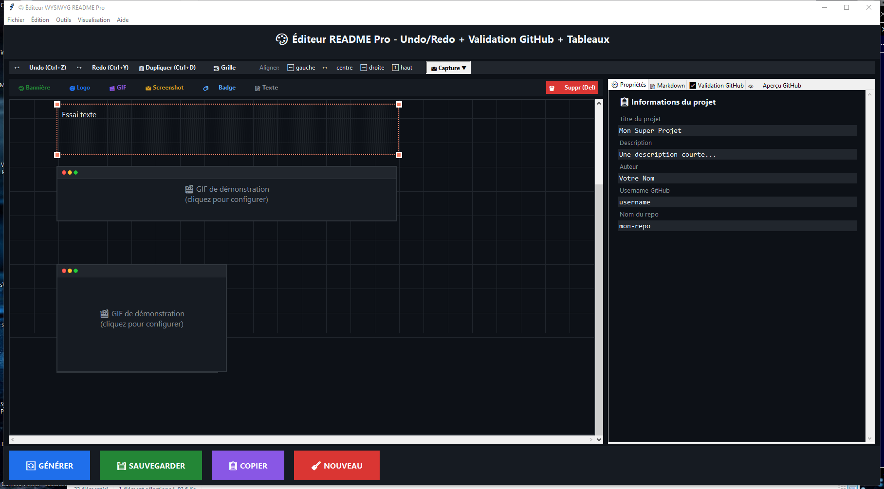

# 📖 Guide d'utilisation détaillé - Générateur README Pro

<div align="center">

**Tout ce que vous devez savoir pour créer des README parfaits**

</div>


## 📑 Table des matières
1. [Présentation](#-présentation)
2. [Installation complète](#-installation-complète)
3. [L'interface utilisateur](#-linterface-utilisateur)
4. [Les éléments WYSIWYG](#-les-éléments-wysiwyg)
5. [Guide des captures d'écran](#-guide-des-captures-décran)
6. [Personnalisation avancée](#-personnalisation-avancée)
7. [Export et validation](#-export-et-validation)
8. [Raccourcis clavier](#-raccourcis-clavier)
9. [Dépannage](#-dépannage)
10. [Bonnes pratiques](#-bonnes-pratiques)


## 🎯 Présentation

Le **Générateur README Pro** est un éditeur WYSIWYG (What You See Is What You Get) conçu pour créer des fichiers README pour GitHub sans avoir à écrire de code Markdown. Il permet de composer visuellement votre documentation en glissant-déposant des éléments, puis génère automatiquement le code Markdown compatible GitHub.

### Pourquoi utiliser cet outil ?
- ✅ **Gain de temps** - Créez des README en quelques minutes
- ✅ **Pas de syntaxe à apprendre** - Interface visuelle intuitive
- ✅ **Prévisualisation instantanée** - Voyez le rendu final en temps réel
- ✅ **Compatibilité GitHub garantie** - Validation automatique
- ✅ **Captures intégrées** - Créez vos images sans quitter l'application


## 🚀 Installation complète

### Windows

```batch
# 1. Installer Python (si non installé)
# Télécharger depuis https://www.python.org/downloads/

# 2. Ouvrir PowerShell ou CMD en administrateur
# 3. Installer toutes les dépendances
pip install tkinter pillow markdown markdown-extensions pymdown-extensions pygments pyautogui keyboard opencv-python numpy pywin32 tkinterhtml

# 4. Lancer l'application
python generateur_readme.py
```

### macOS / Linux

```bash
# 1. Vérifier Python
python3 --version

# 2. Installer les dépendances
pip3 install tkinter pillow markdown markdown-extensions pymdown-extensions pygments pyautogui keyboard opencv-python numpy tkinterhtml

# Note: Pour opencv-python sur macOS, vous pourriez avoir besoin de:
# brew install opencv

# 3. Lancer l'application
python3 generateur_readme.py
```

### Installation minimale (sans aperçu HTML)
Si vous rencontrez des problèmes avec certaines dépendances :

```bash
# Installation de base (fonctionnelle mais sans aperçu HTML)
pip install tkinter pillow markdown pyautogui
```


## 🖥️ L'interface utilisateur



### 1. Barre de menu principale
- **Fichier** : Nouveau, Ouvrir, Sauvegarder, Exporter, Quitter
- **Édition** : Annuler, Rétablir, Copier, Coller, Dupliquer
- **Outils** : Alignement, Capture d'écran, Validation
- **Visualisation** : Zoom, Grille
- **Aide** : Documentation, Raccourcis, À propos

### 2. Toolbar rapide
- **Undo/Redo** : Annuler/rétablir les actions
- **Dupliquer** : Copie l'élément sélectionné
- **Grille** : Active/désactive la grille magnétique
- **Alignement** : Aligne les éléments (gauche, centre, droite, haut)
- **Capture** : Menu déroulant pour les captures d'écran

### 3. Barre d'éléments
Boutons pour ajouter chaque type d'élément :
- 🎨 Bannière
- 🎯 Logo
- 🎬 GIF
- 📸 Screenshot
- 🏷️ Badge
- 📝 Texte

### 4. Zone de travail (Canvas)
- **Grille** : Repère visuel pour l'alignement (50px)
- **Éléments** : Visualisation WYSIWYG de votre README
- **Poignées** : Points oranges pour redimensionner
- **Sélection** : Surbrillance orange de l'élément actif

### 5. Panneau de configuration (droite)
- **⚙️ Propriétés** : Informations du projet
- **📝 Markdown** : Code généré avec option tableau
- **✅ Validation** : Résultats de la compatibilité GitHub
- **👁️ Aperçu** : Rendu en temps réel du README

### 6. Barre d'actions (bas)
- **🔄 GÉNÉRER** : Génère le code Markdown
- **💾 SAUVEGARDER** : Sauvegarde le fichier README.md
- **📋 COPIER** : Copie le code dans le presse-papiers
- **🧹 NOUVEAU** : Réinitialise le projet


## 🧩 Les éléments WYSIWYG

### 🎨 Bannière


**Description** : En-tête coloré pour votre projet.

**Propriétés** :
- `Texte` : Titre principal (ex: "Mon Super Projet")
- `URL image` : Image de fond optionnelle

**Manipulation** :
- **Déplacement** : Cliquer-glisser
- **Redimensionnement** : Poignées sur les coins
- **Édition** : Double-clic

**Rendu Markdown** :

# Mon Super Projet


### 🎯 Logo


**Description** : Logo circulaire avec initiales par défaut.

**Propriétés** :
- `Texte` : Initiales (ex: "MP")
- `URL image` : Image à utiliser (remplace les initiales)

**Manipulation** :
- **Déplacement** : Cliquer-glisser
- **Redimensionnement** : Poignées sur les axes
- **Édition** : Double-clic

**Rendu Markdown** :


### 🎬 GIF


**Description** : Animation ou démonstration.

**Propriétés** :
- `URL image` : Lien vers le GIF
- `Description` : Texte alternatif

**Manipulation** :
- **Déplacement** : Cliquer-glisser
- **Redimensionnement** : Poignées sur les coins
- **Édition** : Double-clic

**Rendu Markdown** :


### 📸 Screenshot


**Description** : Capture d'écran de votre application.

**Propriétés** :
- `URL image` : Chemin de l'image
- `Description` : Texte descriptif

**Manipulation** :
- **Déplacement** : Cliquer-glisser
- **Redimensionnement** : Poignées sur les coins
- **Édition** : Double-clic

**Rendu Markdown** :


### 🏷️ Badge


**Description** : Badges de statut (version, licence, etc.).

**Propriétés** :
- `Texte` : Contenu du badge
- `Couleur` : blue, green, yellow, red

**Manipulation** :
- **Déplacement** : Cliquer-glisser
- **Redimensionnement** : Poignées sur les coins
- **Édition** : Double-clic

**Rendu Markdown** :


### 📝 Texte


**Description** : Texte formaté avec options avancées.

**Propriétés** (éditeur avancé) :
- `Police` : Segoe UI, Arial, Courier New, etc.
- `Taille` : De 8 à 72 points
- `Couleur` : Choix de couleurs prédéfinies
- `Formatage` : Gras, italique, listes

**Manipulation** :
- **Déplacement** : Cliquer-glisser
- **Redimensionnement** : Poignées sur les coins
- **Édition** : Double-clic (éditeur avancé)

**Rendu Markdown** :

Description détaillée de votre projet avec **gras** et *italique*.

- Liste d'éléments
- Sous-points


## 📸 Guide des captures d'écran

### Introduction
L'outil intègre un système complet de capture d'écran qui vous permet de créer directement les images pour votre README sans quitter l'application.

### 1. Capture PNG (image fixe)

**Étapes** :
1. Cliquez sur **"📸 Capture"** dans la toolbar
2. Sélectionnez **"🖼️ Capture PNG"**
3. Le curseur se transforme en croix
4. Cliquez et glissez pour sélectionner une zone
5. Relâchez la souris pour capturer
6. Une boîte de dialogue vous propose d'ajouter l'image au canvas

**Raccourci** : `Ctrl+Shift+S`

**Conseils** :
- Utilisez pour les captures d'interface
- Les images sont automatiquement nommées `screenshot_AAAAMMJJ_HHMMSS.png`
- Stockées dans le dossier `images/`

### 2. Capture GIF (animation)

**Étapes** :
1. Cliquez sur **"📸 Capture"** → **"🎬 Capture GIF"**
2. Sélectionnez la zone à capturer
3. Une fenêtre s'ouvre pour configurer :
   - **Durée** : en secondes (ex: 3s)
   - **Images par seconde** : fluidité (recommandé: 10-15 fps)
4. Un compte à rebours de 3 secondes démarre
5. La capture s'effectue automatiquement
6. Le GIF est sauvegardé et proposé à l'ajout

**Raccourci** : `Ctrl+Shift+G`

**Conseils** :
- Idéal pour montrer une interaction
- 3-5 secondes suffisent généralement
- 10 fps est un bon compromis taille/fluidité
- Évitez les GIFs trop longs (>10s)

### 3. Capture vidéo

**Étapes** :
1. Cliquez sur **"📸 Capture"** → **"📽️ Capture Vidéo"**
2. Sélectionnez la zone à capturer
3. Configurez :
   - **Durée** : en secondes
   - **Images par seconde** : 15-30 fps recommandé
4. La capture démarre après 3 secondes
5. La vidéo est sauvegardée au format MP4

**Raccourci** : `Ctrl+Shift+V`

**Conseils** :
- Pour des démonstrations plus longues
- Qualité supérieure au GIF
- À héberger ailleurs (YouTube, Imgur) et linker

### 4. Capture de fenêtre

**Étapes** :
1. Cliquez sur **"📸 Capture"** → **"🪟 Capture fenêtre"**
2. Une liste des fenêtres ouvertes s'affiche
3. Sélectionnez la fenêtre à capturer
4. Cliquez sur "Capturer"
5. L'image est sauvegardée et proposée à l'ajout

**Conseils** :
- Utile pour capturer une application spécifique
- Évite de devoir recadrer manuellement


## ⚙️ Personnalisation avancée

### Grille magnétique
- Activez la grille avec le bouton **"🧲 Grille"**
- Les éléments s'alignent automatiquement sur les points de la grille (50px)
- Idéal pour des alignements parfaits

### Alignement multiple
1. Sélectionnez plusieurs éléments (Ctrl+clic ou Ctrl+A)
2. Utilisez les boutons d'alignement :
   - **⬅️ Gauche** : Aligne à gauche
   - **↔️ Centre** : Centre horizontalement
   - **➡️ Droite** : Aligne à droite
   - **⬆️ Haut** : Aligne en haut

### Zoom
- **Zoom avant** : `Ctrl++` ou menu Visualisation
- **Zoom arrière** : `Ctrl+-`
- **Réinitialiser** : menu Visualisation

### Sauvegarde de projet
Les projets sont sauvegardés au format `.rproj` (JSON) et incluent :
- Positions de tous les éléments
- Propriétés personnalisées
- Configuration du projet


## 📤 Export et validation

### Génération Markdown
1. Cliquez sur **"🔄 GÉNÉRER"**
2. Le code apparaît dans l'onglet **"📝 Markdown"**
3. Option **"Tableau Markdown"** pour aligner les images en tableau

### Validation GitHub
L'onglet **"✅ Validation GitHub"** vérifie :
- ❌ Absence de JavaScript
- ❌ Absence de CSS avancé (position, transform...)
- ❌ Absence d'iframes
- ✅ URLs d'images valides
- ⚠️ Nombre de GIFs (risque de lenteur)
- ⚠️ URLs relatives

**Score de compatibilité** : /100
- 100% : Parfait pour GitHub
- 80-99% : Quelques avertissements
- <80% : Problèmes à corriger

### Sauvegarde README.md
- Bouton **"💾 SAUVEGARDER"** ou `Ctrl+S`
- Choisissez l'emplacement et le nom
- Par défaut : `README.md`

### Copier dans le presse-papiers
- Bouton **"📋 COPIER"**
- Collez ensuite où vous voulez (GitHub, éditeur...)


## ⌨️ Raccourcis clavier complets

| Catégorie | Raccourci | Action |
|-----------|-----------|--------|
| **Fichier** | `Ctrl+N` | Nouveau projet |
| | `Ctrl+O` | Ouvrir un projet |
| | `Ctrl+S` | Sauvegarder le projet |
| | `Ctrl+E` | Exporter en Markdown |
| | `Ctrl+Q` | Quitter |
| **Édition** | `Ctrl+Z` | Annuler |
| | `Ctrl+Y` | Rétablir |
| | `Ctrl+X` | Couper |
| | `Ctrl+C` | Copier |
| | `Ctrl+V` | Coller |
| | `Ctrl+D` | Dupliquer |
| | `Suppr` | Supprimer |
| | `Ctrl+A` | Tout sélectionner |
| **Déplacement** | `←↑↓→` | Déplacer de 10px |
| | `Shift+←↑↓→` | Déplacer de 50px (avec grille) |
| **Capture** | `Ctrl+Shift+S` | Capture PNG |
| | `Ctrl+Shift+G` | Capture GIF |
| | `Ctrl+Shift+V` | Capture vidéo |
| **Affichage** | `Ctrl++` | Zoom avant |
| | `Ctrl+-` | Zoom arrière |
| | `Ctrl+0` | Réinitialiser zoom |


## 🔧 Dépannage

### Problème : Les poignées de redimensionnement n'apparaissent pas
**Solution** : Cliquez une fois sur l'élément pour le sélectionner. Les poignées oranges doivent apparaître. Si ce n'est pas le cas, vérifiez que l'élément est bien sélectionné (bordure orange).

### Problème : L'aperçu GitHub n'affiche pas les images locales
**Solution** : 
1. Assurez-vous que `tkinterhtml` est installé : `pip install tkinterhtml`
2. Vérifiez que les images sont dans le dossier `images/`
3. Les chemins doivent être relatifs : `images/mon_image.png`

### Problème : La capture d'écran ne fonctionne pas
**Solution** :
```bash
# Réinstaller pyautogui
pip uninstall pyautogui
pip install pyautogui

# Sur macOS, donner les permissions d'accessibilité
# Aller dans Préférences Système > Sécurité > Confidentialité > Accessibilité
# Ajouter votre terminal
```

### Problème : Erreur "Module not found"
**Solution** : Installez le module manquant
```bash
pip install nom_du_module
```

### Problème : L'application est lente
**Solution** :
- Réduisez le nombre d'éléments sur le canvas
- Évitez les GIFs trop volumineux
- Fermez les onglets inutilisés


## 💡 Bonnes pratiques

### Pour un README professionnel

1. **Structure claire**
   - Bannière avec le nom du projet
   - Logo ou identité visuelle
   - Badges (version, licence, stats)
   - Description courte
   - GIF de démonstration
   - Captures d'écran
   - Instructions d'installation
   - Footer avec crédits

2. **Images optimisées**
   - PNG pour les captures d'interface
   - GIF courts (<5s) pour les démos
   - Compressez vos images avec des outils comme [TinyPNG](https://tinypng.com/)

3. **Validation avant publication**
   - Générez le README
   - Vérifiez l'onglet Validation
   - Corrigez les erreurs
   - Testez l'aperçu GitHub

### Exemple de README réussi


<div align='center'>

# Mon Super Projet


Une description courte mais percutante de votre projet.


</div>


## 📸 Captures d'écran

| Interface principale | Configuration |
|---------------------|---------------|
|  |  |

## 🚀 Installation

```bash
pip install mon-projet
```

## 📖 Documentation

Consultez le [guide complet](guide.md) pour plus de détails.

## 🤝 Contribuer

Les contributions sont les bienvenues !

## 📄 Licence

MIT © Gérard D (UnAlphaOne)


## 🎉 Conclusion

Félicitations ! Vous savez maintenant utiliser toutes les fonctionnalités du **Générateur README Pro**. 

### Rappel des points clés :
- ✅ Interface WYSIWYG intuitive
- ✅ 6 types d'éléments personnalisables
- ✅ Outils de capture intégrés
- ✅ Validation GitHub automatique
- ✅ Aperçu en temps réel
- ✅ Raccourcis clavier complets

### Prochaines étapes :
1. Créez votre premier README
2. Expérimentez avec les différents éléments
3. Utilisez les captures pour illustrer votre projet
4. Publiez sur GitHub et partagez !


<div align='center'>

**⭐ Si ce guide vous a été utile, n'oubliez pas de mettre une étoile sur le dépôt !**

Besoin d'aide ? [Ouvrez une issue](https://github.com/votre-repo/issues)

</div>
